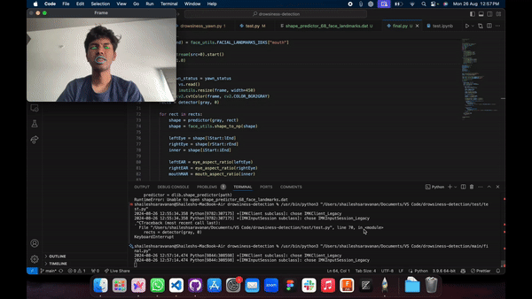

# Drowsiness Detection System

This project implements a real-time drowsiness detection system using computer vision techniques. It utilizes facial landmarks to monitor eye and mouth aspect ratios to determine whether a user is drowsy or yawning. If certain thresholds are exceeded, the system triggers alerts.



## Directory Structure

```
project/
├── train/              # Directory for training-related scripts or data (if applicable)
├── test/               # Directory for testing-related scripts or data (if applicable)
└── main/               # Main application directory
    ├── final.py        # Main script for drowsiness detection
    └── shape_predictor_68_face_landmarks.dat  # Pre-trained face landmark predictor
```

## Requirements

Make sure you have the following libraries installed:

- `numpy`
- `imutils`
- `opencv-python`
- `dlib`
- `scipy`

You can install them using pip:

```bash
pip install numpy imutils opencv-python dlib scipy
```

## How It Works

### Main Components

1. **Eye Aspect Ratio (EAR)**: The system calculates the eye aspect ratio using the distance between certain facial landmarks. If the EAR drops below a defined threshold, it indicates that the user may be drowsy.

2. **Mouth Aspect Ratio (MAR)**: Similarly, the system calculates the mouth aspect ratio to detect yawning. If the MAR exceeds a certain threshold, a yawn is detected.

### Script Explanation

The main functionality resides in `final.py`:

1. **Importing Libraries**: The script imports necessary libraries for facial detection, image processing, and video streaming.

2. **Functions**:
   - `eye_aspect_ratio(eye)`: Computes the EAR based on facial landmarks of the eye.
   - `mouth_aspect_ratio(inner)`: Computes the MAR based on facial landmarks of the mouth.

3. **Parameters**: The system defines thresholds for EAR and MAR:
   - `EYE_AR_THRESH`: Threshold for eye aspect ratio (0.2).
   - `MOUTH_AR_THRESH`: Threshold for mouth aspect ratio (0.35).
   - `EYE_AR_CONSEC_FRAMES`: Number of consecutive frames below the EAR threshold before triggering the alert.
   - `MAR_AR_Counter`: Number of frames that a yawn must be detected before an alert is shown.

4. **Face Detection**: The script initializes the face detector and predictor using the Dlib library. It uses the pre-trained model `shape_predictor_68_face_landmarks.dat` for facial landmark detection.

5. **Video Streaming**: The script captures video from the webcam and processes each frame:
   - It converts the frame to grayscale and detects faces.
   - For each detected face, it computes the EAR and MAR.
   - If the EAR or MAR crosses the defined thresholds, it triggers alerts on the video feed.

6. **Alert System**: 
   - Displays "Yawn Alert!!!" if a yawn is detected.
   - Displays "Drowsiness Alert!!!" if drowsiness is detected.
   
7. **Exit**: The script continues running until the user presses the "q" key to quit.

## Running the Application

To run the drowsiness detection system, navigate to the `main` directory and execute the following command:

```bash
python final.py
```

Ensure that your webcam is enabled and accessible. The application will start capturing video and monitoring for drowsiness or yawning.

## Conclusion

This drowsiness detection system serves as a foundation for developing more advanced fatigue detection systems. Feel free to expand upon this code for additional features, such as logging alerts or integrating with other applications.